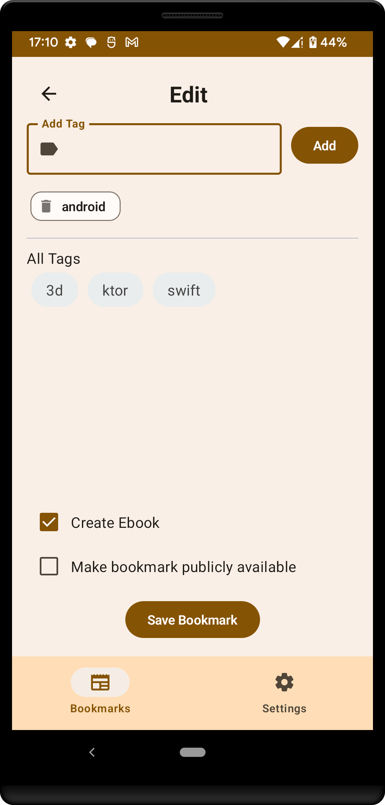
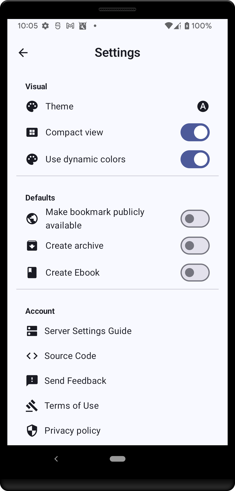
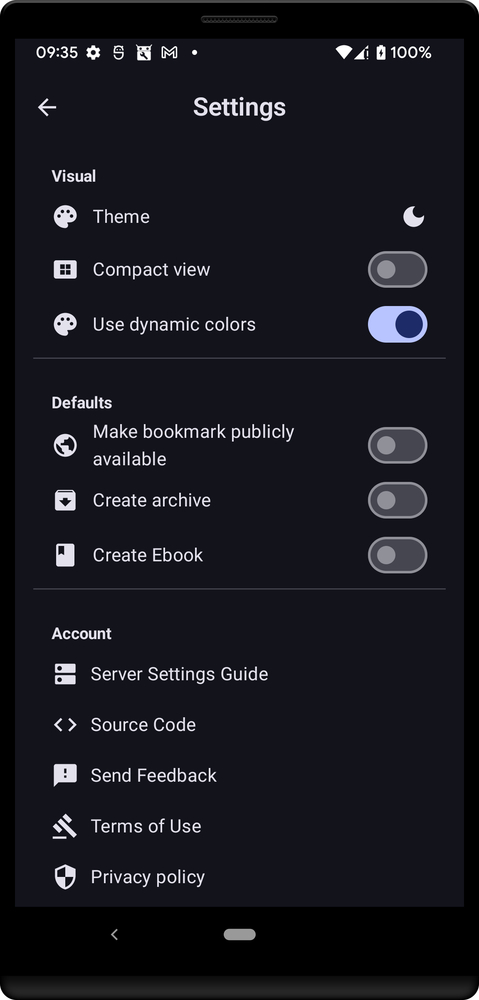
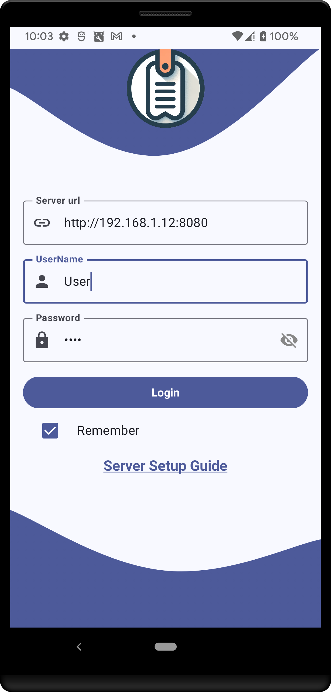
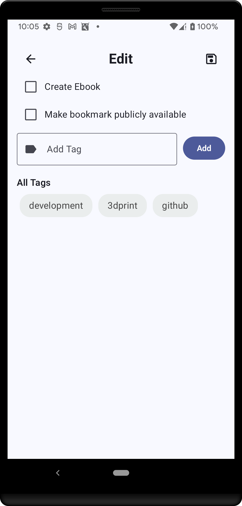

<h1 align="center">
  
   Shiori 
</h1>

  
  
  
  
 

  <h3>
    <a href="#description">Description</a>
     | 
    <a href="#screenshot">Screenshot</a>
     | 
    <a href="#features">Features</a>
     | 
    <a href="#technologies-used">Technologies Used</a>
     | 
    <a href="#download">Download</a>
     | 
    <a href="#license">License</a>
  </h3>

## Description
Shiori is an innovative bookmark management application that revolutionizes the way users save, organize, and access their favorite web pages. Built upon the robust [Shiori platform](https://github.com/go-shiori/shiori), Shiori offers a seamless experience across all devices.

## Screenshots
|                                                      |                                                      |                                                      |                                                      |
|:----------------------------------------------------:|:----------------------------------------------------:|:----------------------------------------------------:|:----------------------------------------------------:|
|  |  |  |  |
|  |  |  |  |

## Features
- **Save Pages Easily**: Instantly capture and access web pages at any time, even offline.
- **Superior Organization**: Custom labels, descriptions, and thumbnails for efficient bookmark sorting.
- **Cloud Synchronization**: Sync your bookmarks across all devices.
- **Intuitive Interface**: User-friendly navigation for a seamless experience.

## Technologies Used
Shiori is built using a variety of modern and robust technologies to ensure scalability, maintainability, and performance:
- **Clean Architecture**: Ensuring separation of concerns and modular design.
- **Dependency Injection (DI)**: For managing dependencies effectively.
- **Model-View-ViewModel (MVVM)**: For a responsive and powerful user interface.
- **Use Cases**: Defining clear business logic.
- **Repository Pattern**: For efficient data handling and abstraction.
- **Protobuf (Proto)**: For efficient data serialization.

## Download

Shiori is available for download on various platforms:

  
  
  
  
  

## License
This project is licensed under the Apache License - see the [LICENSE](LICENSE) file for details.

