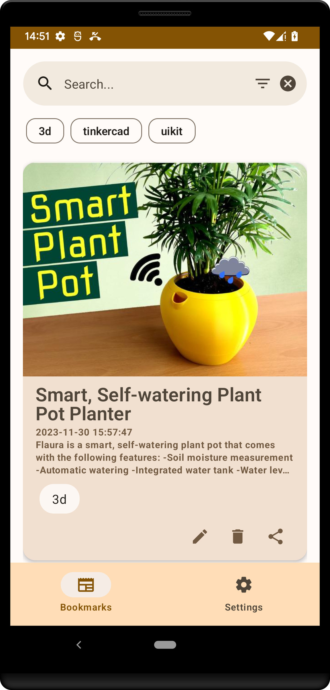
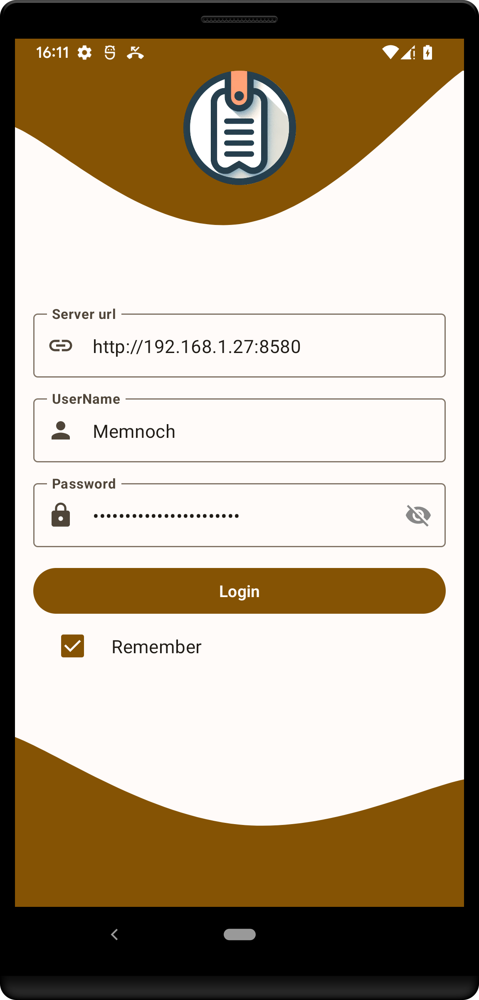

# PageKeeper

## Introduction
PageKeeper is an innovative bookmark management application that revolutionizes the way users save, organize, and access their favorite web pages. Built upon the robust Shiori platform, PageKeeper offers a seamless experience across all devices.

## Screenshots

## Features
- **Save Pages Easily**: Instantly capture and access web pages at any time, even offline.
- **Superior Organization**: Custom labels, descriptions, and thumbnails for efficient bookmark sorting.
- **Cloud Synchronization**: Sync your bookmarks across all devices.
- **Intuitive Interface**: User-friendly navigation for a seamless experience.
- **Share and Discover**: Share bookmarks with the community and discover new pages.

## Technologies Used
PageKeeper is built using a variety of modern and robust technologies to ensure scalability, maintainability, and performance:
- **Clean Architecture**: Ensuring separation of concerns and modular design.
- **Dependency Injection (DI)**: For managing dependencies effectively.
- **Model-View-ViewModel (MVVM)**: For a responsive and powerful user interface.
- **Use Cases**: Defining clear business logic.
- **Repository Pattern**: For efficient data handling and abstraction.
- **Protobuf (Proto)**: For efficient data serialization.

## Tests
Tests are an essential part of software development for ensuring reliability and stability. Currently, the test suite for PageKeeper is under development and pending completion. Contributions in this area are highly appreciated.

## Available on Google Play
PageKeeper is available for download on Google Play. Get the app [here](https://play.google.com/store/apps/details?id=com.desarrollodroide.pagekeeper&hl=es_419&gl=US).

## License
This project is licensed under the Apache License - see the [LICENSE](LICENSE) file for details.

