<h1 align="center">
  
  <br>Shiori<br>
</h1>

<p align="center">
  <a href="https://github.com/DesarrolloAntonio/Shiori-Android-Client/actions">
    
  </a>
  <a href="https://github.com/DesarrolloAntonio/Shiori-Android-Client/blob/master/LICENSE">
    
  </a>
  <a href="https://github.com/DesarrolloAntonio/Shiori-Android-Client/releases">
    
  </a>
  <a href="https://github.com/DesarrolloAntonio/Shiori-Android-Client/issues">
    
  </a>
 <a href="https://github.com/DesarrolloAntonio/Shiori-Android-Client/commits">
    
  </a>
</p>

<div align="center">
  <h3>
    <a href="#description">Description</a>
    <span> | </span>
    <a href="#screenshots">Screenshots</a>
    <span> | </span>
    <a href="#features">Features</a>
    <span> | </span>
    <a href="#requirements">Requirements</a>
    <span> | </span>
    <a href="#built-with">Built With</a>
    <span> | </span>
    <a href="#building">Building</a>
    <span> | </span>
    <a href="#download">Download</a>
    <span> | </span>
    <a href="#license">License</a>
  </h3>
</div>

## Description

An Android client for [Shiori](https://github.com/go-shiori/shiori), the self-hosted bookmark
manager. It talks to a server you run yourself: there is no account to sign up for and no service
behind the app, only your own.

The whole library is kept on the device, so the list, the tags and any article you have already
saved are there with no connection at all. What you change while offline — adding, editing,
deleting, asking the server for a fresh copy of a page — is queued and sent when the server can be
reached again.

## Screenshots

### Phone

| | | | |
|:-:|:-:|:-:|:-:|
| 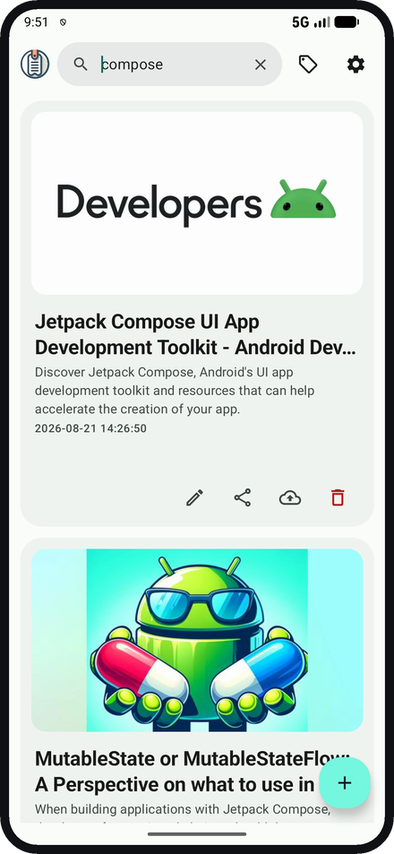 | 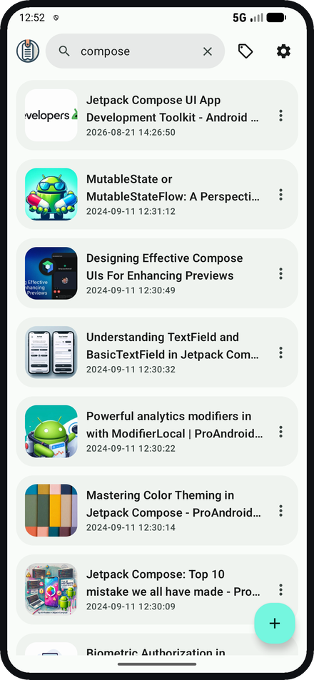 | 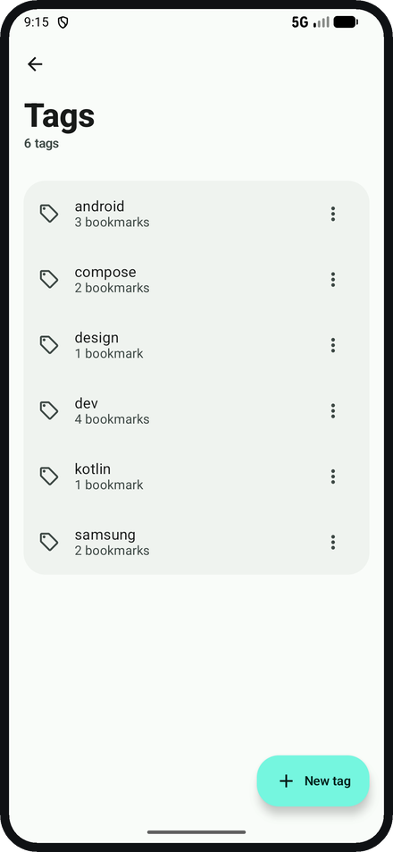 | 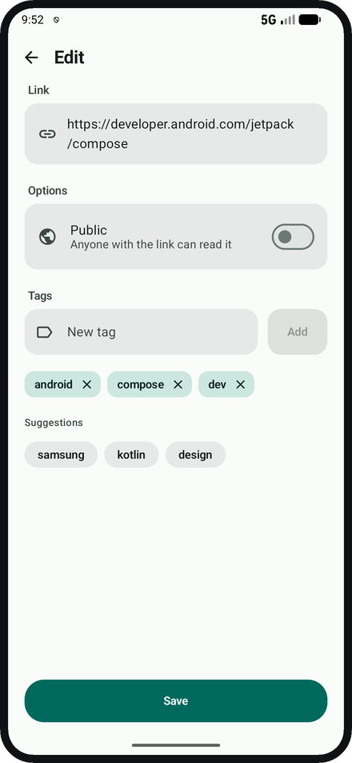 |
| Bookmarks | Compact | Tags | Editor |
| 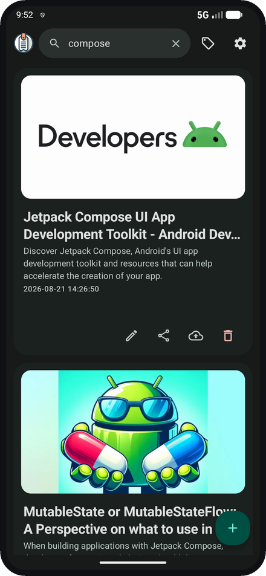 | 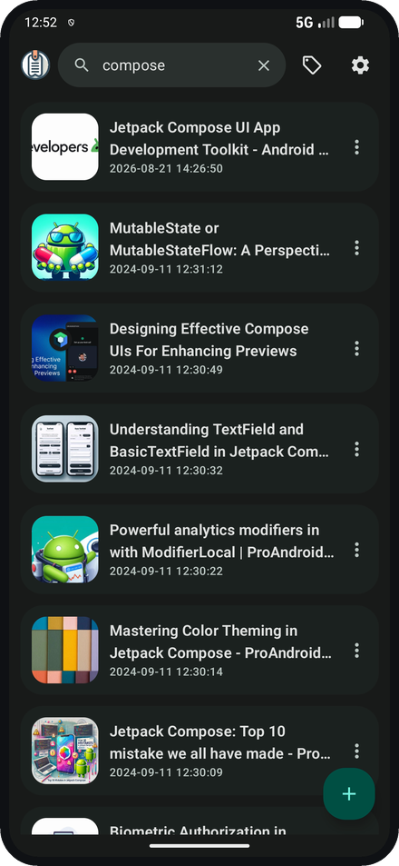 | 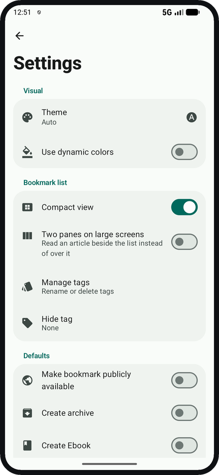 | 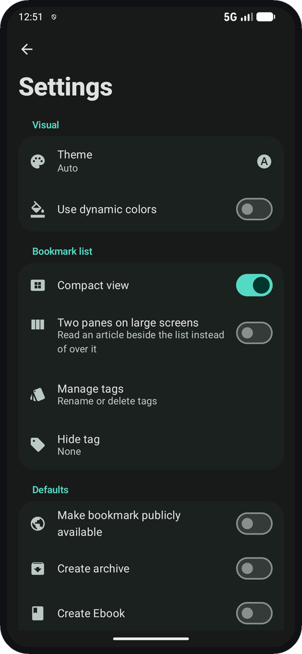 |
| Bookmarks, dark | Compact, dark | Settings | Settings, dark |

### Tablet and foldable

The list is a staggered grid that takes as many columns as the window can hold: one on a phone,
two on an unfolded foldable, three on a tablet.

| | |
|:-:|:-:|
| 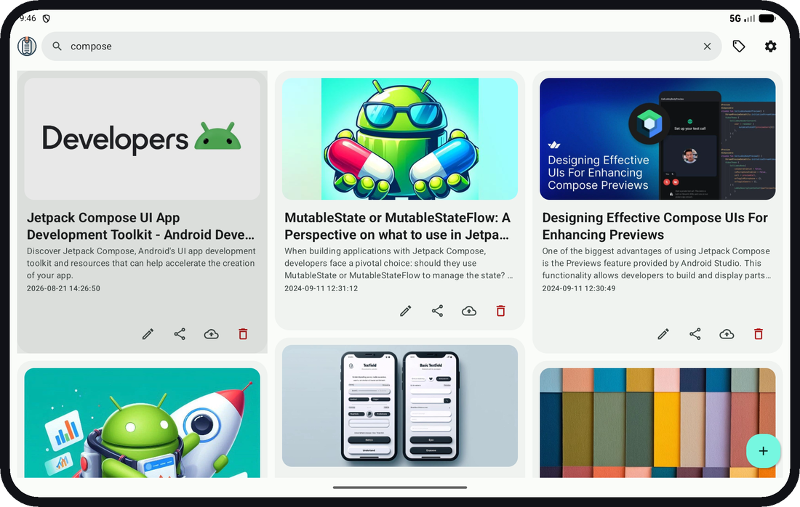 | 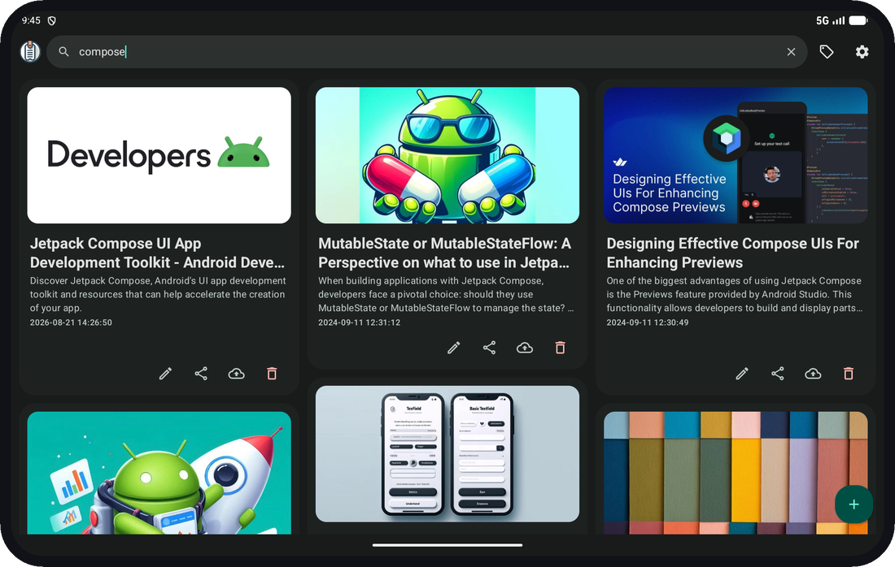 |
| Tablet | Tablet, dark mode |
| 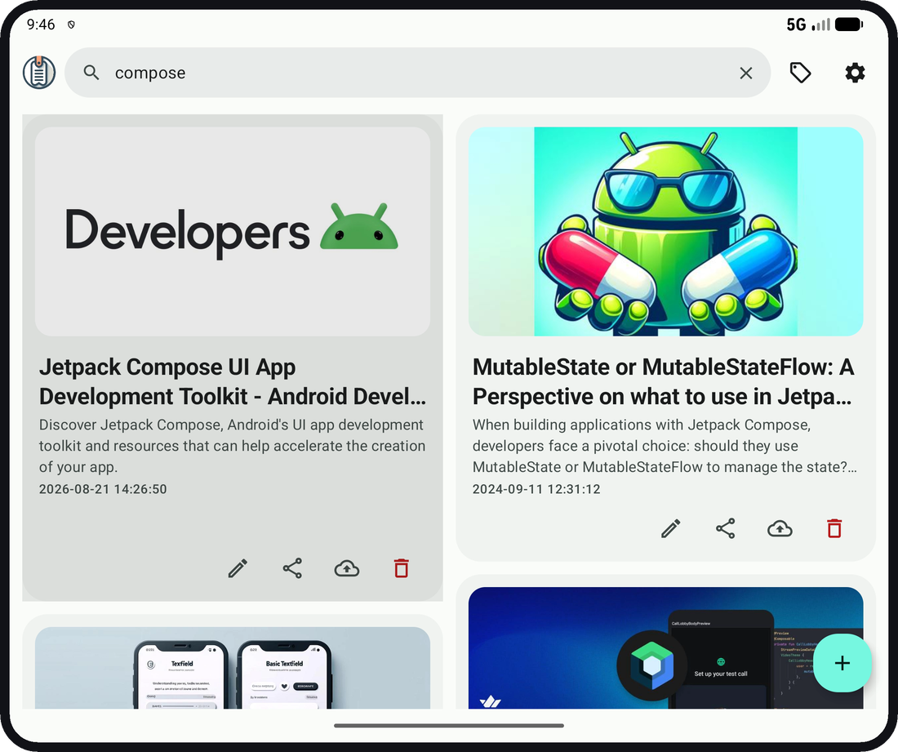 | 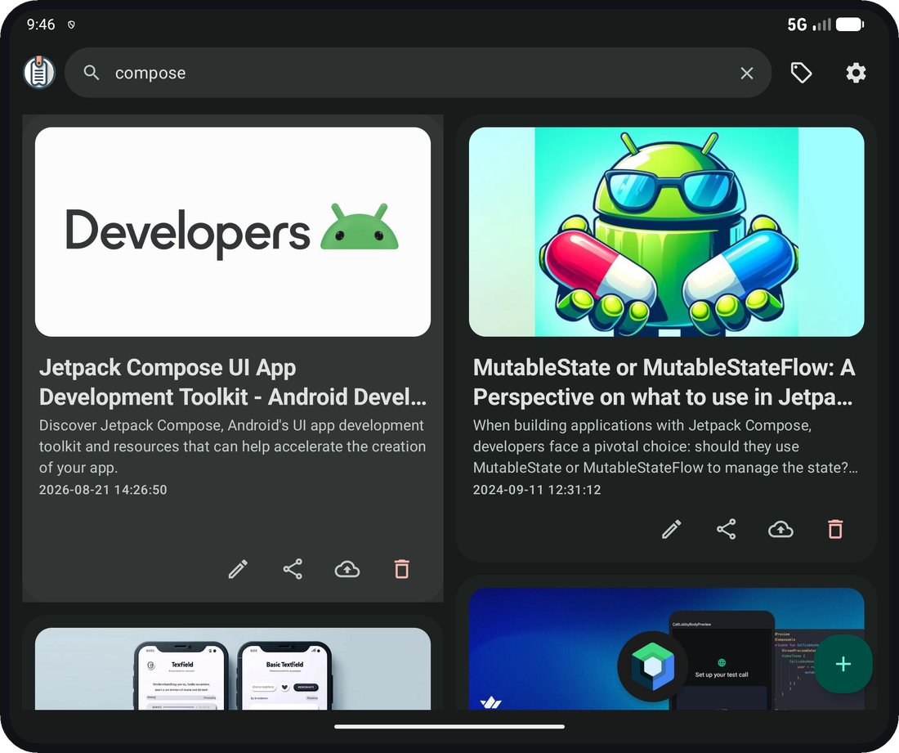 |
| Unfolded foldable | Unfolded foldable, dark mode |

## Features

- **Save from any app.** Shiori registers as a share target, so a page reaches your library from
  the browser's Share menu without opening the app.
- **Read offline.** Articles are stored as readable text, stripped of the site around them, and
  stay available with no connection.
- **Works offline, syncs later.** Changes made without a connection are queued and replayed against
  the server once it answers again.
- **Search** titles, excerpts and URLs, on the device, so it also answers offline.
- **Tags.** Filter the list by tag, rename or delete tags, or hide one tag from the list entirely.
- **Batch actions.** Select several bookmarks to tag, re-cache or delete them in one go.
- **EPUB.** Download the ebook the server made of a page, and pass it on to a reader app.
- **Adaptive layout.** The list is a staggered grid that takes as many columns as the window can
  hold, and on a large screen it can put the article beside the list instead of over it.
- **Material 3** with dynamic colour, light and dark.

## Requirements

- **A Shiori server** you can reach, **1.7 or newer**. Sign-in uses its `/api/v1/auth` API, and
  logout falls back to the pre-1.8 route when the newer one is not there.
- **Android 8.0** (API 26) or newer.

The app asks for the server's address on first launch. Anything the server cannot do, it cannot do
either: it is a client, not a second copy of Shiori.

## Built With

- **[Jetpack Compose](https://developer.android.com/jetpack/compose)** and **Material 3** for the
  whole UI — there are no XML layouts
- **[Room](https://developer.android.com/jetpack/androidx/releases/room)** and **Paging 3** for the
  local copy of the library, which is what the list is actually read from
- **[WorkManager](https://developer.android.com/topic/libraries/architecture/workmanager)** to
  replay offline changes once the server answers again
- **[Retrofit](https://square.github.io/retrofit/)** and **OkHttp** for the API
- **[Koin](https://insert-koin.io/)** for dependency injection
- **[Coil](https://coil-kt.github.io/coil/)** for thumbnails
- **DataStore** for settings and the session
- **Coroutines** and **Flow** throughout

Laid out in six Gradle modules — `presentation`, `domain`, `data`, `network`, `model`, `common` —
so the UI cannot reach the network without going through a use case first.

## Building

```bash
./gradlew :presentation:assembleProductionDebug
```

Debug builds need nothing beyond a JDK 21 toolchain. Release builds are signed, and read the
keystore from `KEYSTORE_PATH`, `RELEASE_STORE_PASSWORD`, `RELEASE_KEY_ALIAS` and
`RELEASE_KEY_PASSWORD`.

Tests:

```bash
./gradlew test
```

## Download

Shiori is available for download on various platforms:

<p>
  <a href="https://github.com/DesarrolloAntonio/Shiori-Android-Client/releases/latest">
    
  </a>
  <a href="https://play.google.com/store/apps/details?id=com.desarrollodroide.pagekeeper">
    
  </a>
  <a href="https://apt.izzysoft.de/fdroid/index/apk/com.desarrollodroide.pagekeeper">
    
  </a>
  <a href="https://f-droid.org/en/packages/com.desarrollodroide.pagekeeper">
    
  </a>
</p>

## License
This project is licensed under the Apache License - see the [LICENSE](LICENSE) file for details.

