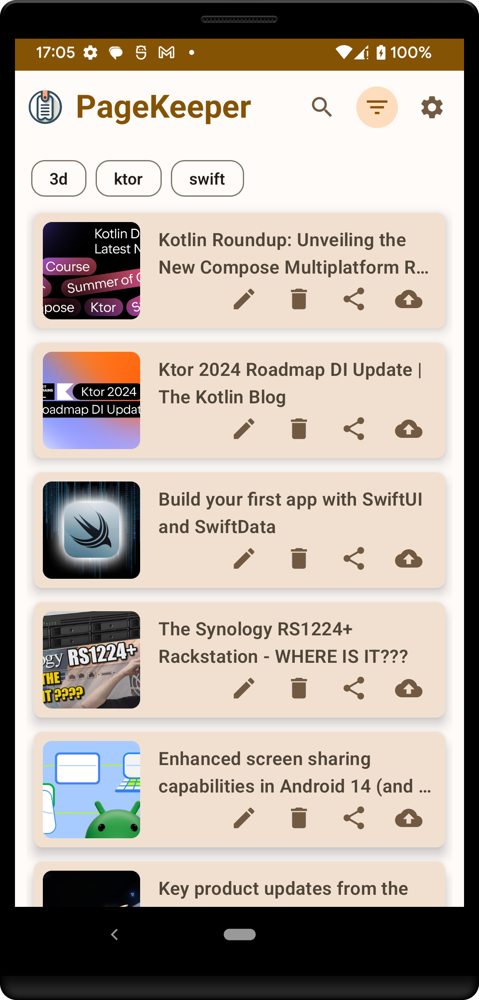
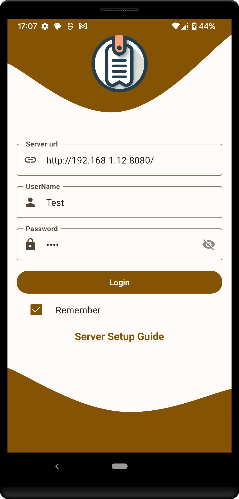

# PageKeeper

## Introduction
PageKeeper is an innovative bookmark management application that revolutionizes the way users save, organize, and access their favorite web pages. Built upon the robust [Shiori platform](https://github.com/go-shiori/shiori), PageKeeper offers a seamless experience across all devices.

|                                               |                                               |                                               |
|:---------------------------------------------:|:---------------------------------------------:|:---------------------------------------------:|
|  |  |  |

## Features
- **Save Pages Easily**: Instantly capture and access web pages at any time, even offline.
- **Superior Organization**: Custom labels, descriptions, and thumbnails for efficient bookmark sorting.
- **Cloud Synchronization**: Sync your bookmarks across all devices.
- **Intuitive Interface**: User-friendly navigation for a seamless experience.

## Technologies Used
PageKeeper is built using a variety of modern and robust technologies to ensure scalability, maintainability, and performance:
- **Clean Architecture**: Ensuring separation of concerns and modular design.
- **Dependency Injection (DI)**: For managing dependencies effectively.
- **Model-View-ViewModel (MVVM)**: For a responsive and powerful user interface.
- **Use Cases**: Defining clear business logic.
- **Repository Pattern**: For efficient data handling and abstraction.
- **Protobuf (Proto)**: For efficient data serialization.

## Tests
Tests are a crucial aspect of software development. The test suite for PageKeeper is currently in the planning stages, with implementation scheduled for a future date.

## Available on Google Play
PageKeeper is available for download on Google Play. 

## Available on IzzyOnDroid
PageKeeper is also available on IzzyOnDroid.

## License
This project is licensed under the Apache License - see the [LICENSE](LICENSE) file for details.

